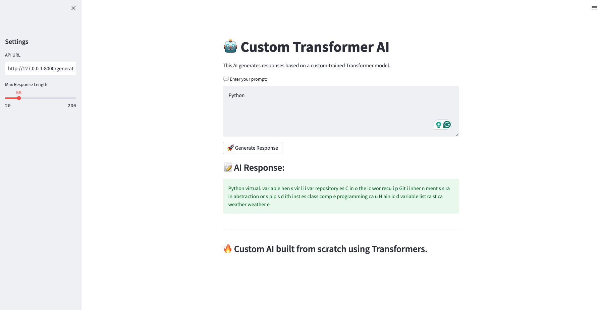

# **Custom Transformer AI**

## **📌 Project Overview**
This project is a **custom-built Transformer AI** designed to generate text responses based on user-provided prompts. Unlike pre-trained models (e.g., GPT-2), this AI model is trained from scratch using a custom dataset and tokenizer. It includes:

- A **tokenizer** to convert text into numerical representations.
- A **Transformer-based neural network** for text generation.
- An **API server (FastAPI)** to serve the AI model.
- A **Streamlit UI** to interact with the AI via a web interface.

AI-Interface:



---
## **📂 Project Structure**
```
📁 CB-Gen
│── 📁 api/              # FastAPI server files
│── 📁 data/             # Custom dataset files
│── 📁 models/           # Saved tokenizer and trained model
│── 📁 scripts/          # Training and tokenizer scripts
│── 📁 ui/               # Streamlit UI files
│── README.md           # Project documentation
│── requirements.txt    # Dependencies
```

---
## **🛠 Installation & Setup**
### **🔹 Prerequisites**
Ensure you have **Python 3.9+** and install dependencies:
```bash
pip install -r requirements.txt
```

---
## **🚀 Running the Application**
Follow these steps in order:

### **1️⃣ Train the Tokenizer**
```bash
python scripts/train_tokenizer.py
```
✅ **What it does:**
- Reads `my_dataset.jsonl` and **learns word mappings**.
- Saves a **new tokenizer** to `models/tokenizer.json`.

### **2️⃣ Train the Transformer Model**
```bash
python scripts/train_transformer.py
```
✅ **What it does:**
- Loads the tokenizer and dataset.
- Trains the **Transformer model** using the dataset.
- Saves the trained model to `models/custom_transformer.pth`.

### **3️⃣ Start the FastAPI Server**
```bash
uvicorn api.server:app --reload
```
✅ **What it does:**
- Loads the trained model.
- Starts an API at `http://127.0.0.1:8000`.
- Provides an endpoint `/generate` for text generation.

### **4️⃣ Test the API**
```bash
curl "http://127.0.0.1:8000/generate?prompt=What%20is%20Python?"
```
✅ **What it does:**
- Sends a request to the API.
- API processes the request using the trained Transformer.
- Returns an AI-generated response.

### **5️⃣ Run the Web UI (Optional)**
```bash
streamlit run app.py
```
✅ **What it does:**
- Launches a **web-based interface**.
- Allows users to **enter prompts** and get AI responses visually.

---
## **📊 Understanding Model Variables**
The following variables in `train_transformer.py` control training:

| **Variable** | **Description** | **Default Value** |
|-------------|----------------|------------------|
| `learning_rate` | Controls how fast the model learns | `0.0002` |
| `batch_size` | Number of samples per training step | `16` |
| `epochs` | Total training iterations | `15` |
| `vocab_size` | Number of words the model recognizes | `500` |
| `max_length` | Maximum token length for input/output | `64` |
| `batch_first` | Ensures batch-first format for transformers | `True` |

🔹 **Modify these variables** in `train_transformer.py` to tune performance.

---
## **🎯 Next Steps & Improvements**
- Increase **dataset size** (5000+ prompts) for better generalization.
- Experiment with **larger model architectures** (e.g., `num_layers=12`).
- Implement **top-k or nucleus sampling** for more natural responses.

🚀 **Enjoy building your own AI!** Let me know if you need enhancements. 🔥

